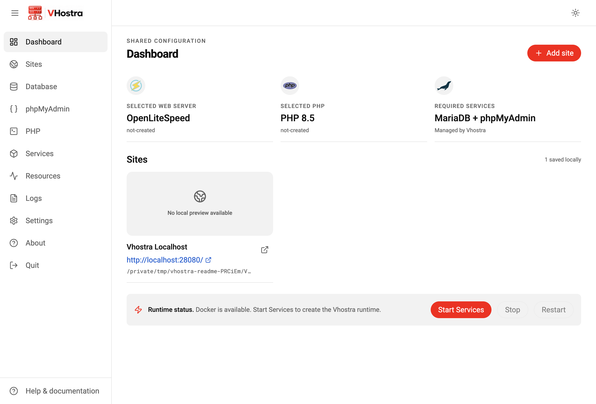

<p align="center">
  
</p>

Vhostra is a lightweight, cross-platform graphical local PHP development environment. It is designed around one shared runtime: many local websites use one selected web server, one selected PHP version, and shared supporting services.

**Local development only.** Vhostra runs on your own computer and is not a production hosting control panel. Its runtime and security model are intended for local development, not an Internet-facing server. It does not provide the hosting or SSL management expected of a production platform. Local database and Site configuration exports can help you move a project to a separate production host.

## Source and Licensing

Vhostra's source is publicly viewable, but no software license is currently granted for Vhostra itself. Third-party software, fonts, icons, and assets retain their own terms; see [THIRD_PARTY_NOTICES.md](THIRD_PARTY_NOTICES.md).

> Development status: Vhostra persists settings and site/neutral-vhost definitions locally, creates a protected localhost welcome page, and manages its dedicated web/PHP runtime and independent persistent MariaDB container. The current desktop UI includes real MariaDB management, phpMyAdmin launching, port checks, hosts-file integration, PHP extension discovery, and runtime lifecycle controls. Portable JSON configuration import/apply and verified configuration-location migration are implemented. Bounded Apache/Nginx/LiteSpeed configuration import, first-run onboarding, and visible-only resource monitoring are implemented. First-run Vhostra JSON backup restoration and protected reset are implemented. Dashboard previews are captured locally and cached. Backups from unrelated formats remain outside the supported workflows.



*Dashboard in a fresh profile, before starting services.*

## Features

- Electron desktop application for macOS, Windows, and Linux
- React, TypeScript, Vite, and Tailwind CSS interface
- Responsive, collapsible navigation for Dashboard, Sites, Database, phpMyAdmin, PHP, Services, Resources, Logs, and Settings
- Dashboard and tray backed by the same real Docker-runtime status, with Start, Stop, and Restart actions
- Add, edit, and remove site definitions without changing document-root files
- Native document-root folder selection and secure OS-default browser opening for local site URLs
- Persisted selected web server, PHP version, and Redis/Memcached preferences
- First-run defaults of OpenLiteSpeed and the latest supported PHP policy (currently PHP 8.5)
- Protected, server-neutral `http://localhost/` definition with a static host-side Vhostra welcome page
- System tray/menu-bar entry that keeps Vhostra available after its window closes
- Configuration bundle export, validation preview, and import
- Typed, server-neutral virtual-host model used for portable imports and server configuration generation
- Typed local-first storage layout, configuration ownership, snapshot, and portable bundle models
- Exact-source macOS, Windows, Linux, window, and favicon application icons
- Authoritative branding assets derived directly from `logo/logos.png`
- PHP extension inventory obtained from the selected LSPHP package catalog when the runtime is running; selected optional extensions are installed into the replacement image and checked through the real PHP request path
- Zend OPcache preference and `cwebp` support (enabled by default); `cwebp` is supplied by the runtime’s `webp` package and validated in the runtime health check
- Hosts-file mappings for virtual-host hostnames and aliases, using a narrow elevation prompt rather than running the app with permanent administrator privileges
- Launch-on-login and optional runtime-start-on-launch preferences

## Architecture summary

Vhostra runs exactly one global web server and exactly one global PHP runtime at a time. Websites are vhosts within that shared environment—not individual stacks. MariaDB and phpMyAdmin are required shared services; Redis and Memcached are optional shared services.

Supported web servers: Apache, Nginx, and OpenLiteSpeed. Only the selected implementation is used.

Supported PHP versions: PHP 8.1, 8.2, 8.3, 8.4, and 8.5.

### First-run environment defaults

New Vhostra profiles select OpenLiteSpeed. PHP uses a `latestSupported` policy: it resolves from the supported PHP-version list rather than embedding a permanent version value; at present that resolves to PHP 8.5. MariaDB and phpMyAdmin remain required shared services. Redis and Memcached remain optional and disabled by default. All of these preferences are persisted when changed.

Vhostra also creates a protected, server-neutral localhost site definition at `http://localhost/`. Its document root is created under Vhostra's host-side data directory and contains a lightweight static Tailwind welcome page with current saved preferences, runtime status, and links to configured sites. When services are running, it is served through the selected web server rather than Electron or Vite.

## Docker runtime and ports

Docker Desktop (or a compatible Docker Engine with the Compose plugin) is required. Start Services verifies Docker, checks required host ports, generates and validates the Vhostra-only Compose project, and starts the selected stack.

- `http://localhost:9000` is the Vite development UI only.
- `http://localhost/` is the Vhostra managed local web-server entry point.
- `http://localhost:9080/` is phpMyAdmin. Its image keeps internal port 80; only the host binding is 9080.

Vhostra checks the configured HTTP, phpMyAdmin, and MariaDB ports before startup (defaults 80, 9080, and 3306). Port 443 is checked only as an optional HTTPS capability: if another application such as Tailscale Serve owns it, Vhostra starts HTTP normally on port 80 and reports HTTPS as unavailable without touching the owner.

## Local-first storage and persistence

Vhostra keeps its application data in Electron's platform-specific `userData` location, under a `vhostra` directory. Website document roots are normal user-selected or user-created host directories, not application-managed container paths. The runtime bind-mounts each document root and only the required Vhostra-managed host locations into disposable containers.

The typed storage layout is platform-aware: Electron provides the platform's application-data root for macOS, Windows, or Linux, and the layout derives Vhostra paths from that input. The code does not assume a macOS-only path. Persistent locations include:

- Vhostra settings; site definitions; and neutral virtual-host definitions
- source, imported, custom, and generated configuration
- Apache, Nginx, OpenLiteSpeed, PHP/php.ini, MariaDB, phpMyAdmin, Redis, and Memcached configuration
- public certificates and separately protected private keys
- MariaDB persistent data, logs, backups/snapshots, and configuration exports
- screenshot cache files associated with site definitions

The implemented store persists settings in `settings.json`, plus one site definition and neutral vhost definition per JSON file. Deleting a site removes only those definition files; it never removes the selected document root. Container removal, replacement, or a later runtime switch must not remove website content, databases, settings, vhost definitions, configuration files, certificates, or persistent logs.

The built-in localhost definition is intentionally protected from normal deletion in the desktop UI and store. Its host-side root and generated welcome-page files remain inspectable.

### Configuration ownership

Vhostra distinguishes three configuration layers:

1. **Vhostra source configuration** — the portable source of truth: settings, sites, and neutral vhosts.
2. **User-editable/custom configuration** — explicit additions owned by the user and never silently overwritten.
3. **Generated runtime configuration** — inspectable Apache/Nginx/OpenLiteSpeed/PHP/service files rendered from source configuration for the selected runtime.

Changing the global server renders a new target-server configuration from the neutral vhost model. Imported directives that cannot be made portable are retained as preserved directives and/or reported with compatible, warning, or unsupported classifications.

## Configuration import, export, and recovery

The architecture defines a portable `vhostra/config-bundle` manifest with schema version `1`. The current Export Configuration action writes an all-configuration JSON bundle containing settings, site definitions, and neutral vhost definitions. Preview Import validates a selected bundle; Import Configuration creates a local backup, adds non-conflicting definitions, refreshes runtime configuration, and requests scoped hosts mappings. Each Site can also export on-demand Apache, Nginx, or OpenLiteSpeed virtual-host configuration generated from its canonical definition. OpenLiteSpeed listener mapping is a separate server-level setting, noted in its exported file. Imported directives requiring review remain inactive in incompatible exports.

The Database page can save a local MariaDB SQL dump for deployment elsewhere. Production URL and root directory describe the destination; Vhostra leaves application data unchanged because generic SQL replacement can corrupt serialized or application-specific values. Update those values with the application's supported tools after deployment. Exports do not upload or deploy data.

By default, a portable configuration bundle excludes website content, database contents, passwords/secrets, and private TLS keys. Those require separate, explicit backup/export behavior. Imports create a local recovery snapshot before applying validated site definitions. Migration copies and verifies managed data before switching locations; runtime replacement retains verified configuration and an image lease until promotion/recovery succeeds.

## External browser and screenshots

Clicking a saved site URL, preview, or external-link button opens the validated `http` or `https` URL with the operating system's default browser via Electron's main-process `shell.openExternal` API. Websites are never opened in a Vhostra `BrowserWindow`; the renderer remains isolated with `contextIsolation` enabled and `nodeIntegration` disabled.

Dashboard previews use a screenshot only when a site's definition references a real supported image file in Vhostra's host-side screenshot cache. Otherwise, Vhostra shows a generating or unavailable state. Missing/stale previews are captured locally on Dashboard visibility, with explicit Refresh Preview, a first-screen desktop viewport, compressed host JPEG cache and bounded visual readiness. No screenshot service receives Site URLs or content.

## Tray and application lifecycle

Vhostra creates a platform tray/menu-bar icon and keeps the application available after its primary window is hidden. Settings provides a persisted close-button policy: minimize to the tray (the default), quit while keeping the Vhostra runtime running, or stop only Vhostra-managed services and then quit. Native application-menu Quit, tray Quit and sidebar Quit open **Quit Vhostra?** with **Quit Vhostra and Keep Services Running**, **Quit Vhostra and Stop Services**, and **Cancel**. Keep exits Electron/tray completely; Stop first verifies both web/PHP and MariaDB stopped. Title-bar Close retains its saved policy. The tray shows Open Vhostra only while the window is hidden/minimized; the in-window menubar is removed on Windows/Linux.

Start, Stop, and Restart actions—including individual active-web-server, MariaDB, Redis, and Memcached controls when the runtime supports them—use the same Vhostra-only runtime controller in the Dashboard, Services workspace, tray, and CLI. They operate only against the generated `vhostra` web project and `vhostra-database` MariaDB project and never target unrelated Docker resources.

## Bind mounts

Docker configuration uses explicit host-to-container mount plans. Host paths and container paths are separate typed values. Document roots, generated runtime configuration, persistent database data, certificates, and persistent logs can be mounted according to their purpose and access mode. Containers remain disposable runtime infrastructure; they are never the sole owner of user data.

## Docker isolation and safety principles

The Docker layer uses the dedicated `vhostra` web/PHP Compose project and independent `vhostra-database` project, exact ownership labels/mount checks, and an internal database network. It invokes Compose only against Vhostra's generated project file; it never uses global cleanup or broad Docker stop/remove operations. Website roots, generated configuration, database data, logs, certificates, and service configuration are host bind mounts. A server/PHP change checks a candidate web runtime on temporary ports against the same independent MariaDB container, then promotes only the web/PHP service. It never copies a datadir, stops/restarts the DB, or rebuilds its image for a PHP/frontend change. An intentionally stopped DB stays stopped during a web switch. Legacy recovery never restarts a database-bearing web image alongside the independent DB. Failed promotion restores the verified previous configuration and image. If recovery fails, Vhostra retains recovery files and reports their location.

Security configuration for generated runtimes includes `expose_php=Off` and web-server response version hiding where supported.

## Native configuration import and conversion

Sites → Import existing server configuration previews Apache VirtualHost blocks, Nginx server blocks, self-contained OpenLiteSpeed vhconf files and compatible LiteSpeed Enterprise text configuration. Choose the source server when detection is ambiguous. The desktop chooses individual source configuration files; there is no LiteSpeed installation-directory workflow. The CLI parser can still read a bounded self-contained legacy source tree for conversion; this never selects a runtime configuration directory. It does not read arbitrary external includes, private keys or the old installation's other files.

Import converts explicit hostnames/aliases, absolute document roots, safe index filenames, HTTP/HTTPS intent and supported permalink intent into canonical `virtual-hosts/*.json`. Apache/OLS retain existing site `.htaccess`; Nginx supports the standard PHP front-controller fallback. Custom rewrites, access policies, handlers, listener settings and proprietary directives require review and remain inactive source metadata. Unsupported Enterprise XML/server-global formats are reported as invalid or requiring manual review. This is a limited conversion, not a promise of lossless equivalence. Preview reports Converted, Converted with warnings, Requires review or Invalid; preserved unsupported directives are shown separately. Review access restrictions before accepting warnings.

The original source stays unchanged. Raw native source is retained in local canonical records with mode 0600, with a 4 MiB duplicated original-source budget per import; ordinary state IPC omits raw source bytes; default secret-free exports omit raw source and unclassified preserved directives because they may contain credentials. Default portable exports and automatic import snapshots omit that unclassified source text; the original local canonical records retain it. Ten completed automatic import snapshots are kept. Unknown/failed recovery artifacts are preserved.

Generated native files live in `configuration/generated` and the existing `runtime/{apache,nginx,openlitespeed}` host directories. Generation runs on configuration actions, with no polling parser or filesystem synchronization timer. Switching an existing runtime—including a stopped runtime—validates a candidate, promotes and checks the runtime, restores stopped state when appropriate, and only then removes exact obsolete artifacts carrying the Vhostra ownership marker. Canonical JSON, document roots, databases, Hosts mappings, imported source and unmarked files remain. Rollback restores host-generated copies along with the prior runtime configuration/image.

## First run and resources

Genuine first launch shows welcome, System/Light/Dark appearance, OpenLiteSpeed/Apache/Nginx selection, backend-supported PHP versions (latest by default), optional Redis/Memcached (none by default), and review. Nothing starts until Set Up Vhostra. Setup uses actual runtime operations/progress and records completion only after verified running state; failure preserves choices for retry. Valid existing settings, verified prior runtime state or an existing valid user site bypasses onboarding. Theme, web server, PHP and both independently supported optional caches remain configurable through Settings.

Resources shows Electron CPU and summed process working sets, exact managed runtime container CPU/RAM, categorized local files, managed Docker images/cache and writable layers. Shared memory/image layers are labeled; totals are logical attributed sizes, not exclusive physical disk consumption. External document roots, other Docker projects and Docker Desktop overhead are excluded. Samples run every eight seconds only while visible; requests coalesce and storage scans are bounded/cached for five minutes with explicit refresh. The localhost page has its own browser-local Light/Dark/System choice and icons, with live OS appearance changes.

Vhostra keeps a native resizable frame with an 860 × 620 minimum. Maximize/zoom and fullscreen are disabled on macOS/Windows using Electron window options. On Linux the maximizable setter is a documented no-op; Vhostra reverses native maximize events when delivered, but window managers may still show an enabled control. No custom maximize button is added. See [Electron BrowserWindow](https://www.electronjs.org/docs/latest/api/browser-window).

## CLI commands

After building, run `npm run cli -- help`, or the `vhostra` package executable. All runtime commands share the desktop store/controller and exact managed Compose scope.

```sh
vhostra status [web|apache|nginx|openlitespeed|php|mariadb|phpmyadmin|redis|memcached]
vhostra start|stop|restart [web|apache|nginx|openlitespeed|mariadb|redis|memcached]
vhostra sites list
vhostra sites add /path/site.json
vhostra sites edit SITE_ID /path/site.json
vhostra sites remove SITE_ID
vhostra sites repair [SITE_ID]
vhostra config export|preview|import /path/backup.json
vhostra database list
vhostra database create NAME USER [utf8mb4|utf8|latin1]
vhostra database import|export NAME /path/database.sql
vhostra database repair|delete NAME
vhostra reset
vhostra runtime status|start|stop|restart
vhostra service list
vhostra service web|mariadb|redis|memcached status|start|stop|restart
vhostra web status|start|stop|restart
vhostra mariadb status|start|stop|restart
vhostra php status|versions
vhostra php select 8.4
vhostra php extensions list
vhostra php extension install|remove|enable|disable apcu
vhostra opcache status|enable|disable
vhostra redis status|enable|disable|start|stop|restart
vhostra memcached status|enable|disable|start|stop|restart
vhostra cwebp status|enable|disable
vhostra vhost list
vhostra hosts status|repair [hostname]
vhostra import preview /path/site.conf nginx
vhostra import apply /path/site.conf nginx --accept-warnings
```

Use one alternative per `|` above. Hosts commands verify canonical ownership and use the same scoped administrative mutation path as the desktop. Before protected writes, Vhostra keeps a private local recovery snapshot; it retains ten completed snapshots. The elevated operation verifies the write before removing only its own transient native backup; failed/ambiguous native and local recovery remain available. Exit 0 indicates success, 1 backend/validation failure, 2 invalid import/unresolved mappings or failed/unavailable status target, and 64 invalid command usage. Cache status reports actual Supervisor state as well as saved enablement. A source import with unsupported directives requires preview/review and `--accept-warnings`; imports do not activate source text. Commands dispose temporary listeners/watchers on exit.

## System requirements and prerequisites

- Node.js 20 or newer (development)
- npm 10 or newer (development)
- Docker Desktop or a compatible Docker/Compose installation for runtime management
- macOS, Windows, or a supported Linux distribution

## Installation and development

```bash
npm install
npm run dev
```

`npm run dev` starts Vite and opens Electron. For browser-only interface development, use:

```bash
npm run dev:web
```

The Vite development UI binds to `127.0.0.1:9000`; it is separate from Vhostra's real localhost web-server port and phpMyAdmin port 9080.

## Build and validation

```bash
npm run typecheck
npm run build
```

The build compiles the React renderer and Electron main process. Packaging installers is not configured in this first iteration.

## Project structure

```text
electron/          Electron main-process entry point
  store.ts          Persistent settings, sites, vhosts, bundle, and screenshot-cache store
  preload.ts        Narrow IPC bridge for renderer actions
src/
  assets/          Derived logo, favicon, and application icon assets
  components/      Reusable renderer components (reserved for growth)
  types/           Environment, vhost, desktop bridge, local storage, and portable bundle models
  App.tsx          Application shell and persisted-site/dashboard UI
  welcome/         Static localhost welcome-page source
  styles.css       Tailwind entry point and small global rules
build/             Native app and tray packaging assets
  icon.icns         macOS application icon derived from the source artwork
  icon.ico          Windows application icon derived from the source artwork
  icons/            Linux PNG icon sizes derived from the source artwork
logo/logos.png     Authoritative user-supplied branding source
test/               Persistent-store and URL-safety tests
```

## Current limitations

Automatic Site management requests elevation to create/remove only its own marked hosts-file mappings for sites and aliases. The explicit manual Hosts editor supports reviewed full-file changes. It captures local homepage viewport previews; arbitrary external backups remain unsupported. Native configuration import is limited to the documented convertible text formats; unsupported directives remain inactive and visible. Configuration imports create a local backup, and configuration migration retains the source until destination health checks succeed. A cancelled elevation request during creation/import preserves the new definition and reports missing mappings. An existing Site edit restores its previous canonical/runtime definition if native validation or Hosts elevation fails.

## PHP extensions and cwebp

The PHP screen reports the selected LSPHP package catalog from the running Vhostra image and distinguishes required modules, installed/enabled modules, selected modules awaiting a rebuild, and packages available for installation. Core MariaDB modules cannot be disabled. Redis and Memcached PHP modules are dependency-managed when their corresponding Vhostra service is enabled.

Changing an optional extension, OPcache, or `cwebp` preference persists the desired state and reconciles only the Vhostra runtime when it is currently running. Compatible package images are reused; load-state and OPcache changes do not require an image rebuild. The candidate image fails with an explicit package error if an extension is not offered for the selected LSPHP version. `cwebp` defaults to enabled and is provided by Debian/Ubuntu’s `webp` package inside the disposable runtime image.

## Startup

Settings can register Vhostra at login. macOS and Windows use Electron’s native login-item support; Linux writes only Vhostra’s own XDG autostart desktop entry. The separate “Start configured services when Vhostra opens” setting starts only the Vhostra-managed runtime and respects the persisted Redis/Memcached selections.

## Local configuration path and logs

Settings shows Vhostra's active local configuration path and can move it to an
empty destination. Vhostra stops only its own runtime writers, copies its
settings, generated configuration, certificates, logs, backups, and MariaDB
data, verifies the copied settings, atomically switches its local pointer, and
only then removes the prior Vhostra-owned copy. It never moves external site
document roots or unrelated Docker data.

The Logs page reads persistent host-side logs incrementally: it lists a bounded
set of files and loads at most the newest 64 KiB of one selected file into the
renderer. This avoids retaining huge log files in Electron memory.

## Tray component controls

The tray obtains actual Supervisor state for web/PHP and enabled Redis/Memcached,
and Docker health/process state for the independent MariaDB container.
It exposes only meaningful Start, Stop, and Restart actions for those
Vhostra-managed processes. PHP/LSPHP uses the selected package inside the shared runtime: native LSAPI
for OpenLiteSpeed, or its loopback PHP development backend for Apache/Nginx.
Stopping the web service also stops its associated PHP workers.

## Terminal commands

Vhostra also exposes the same local runtime controller through its CLI. From a
development checkout, use `npm run cli -- …`; after installation the package
provides the `vhostra` command. The CLI never uses global Docker cleanup and
only invokes Vhostra's generated, labeled Compose project.

```bash
vhostra status [web|apache|nginx|openlitespeed|php|mariadb|phpmyadmin|redis|memcached]
vhostra start|stop|restart [web|apache|nginx|openlitespeed|mariadb|redis|memcached]
vhostra sites list
vhostra sites add /path/site.json
vhostra sites edit SITE_ID /path/site.json
vhostra sites remove SITE_ID
vhostra sites repair [SITE_ID]
vhostra config export|preview|import /path/backup.json
vhostra database list
vhostra database create NAME USER [utf8mb4|utf8|latin1]
vhostra database import|export NAME /path/database.sql
vhostra database repair|delete NAME
vhostra reset
vhostra runtime status
vhostra runtime start
vhostra runtime stop
vhostra runtime restart
vhostra service list
vhostra service web restart
vhostra service mariadb restart
vhostra service redis stop
vhostra service redis enable
vhostra service memcached disable

vhostra php extensions list
vhostra php extension enable imagick
vhostra php extension disable imagick
vhostra opcache status
vhostra opcache enable
vhostra cwebp status
vhostra cwebp disable
vhostra redis status
vhostra redis enable
vhostra memcached restart
```

Commands return non-zero for invalid syntax, unavailable Docker, failed health
checks, or failed runtime operations. `VHOSTRA_USER_DATA` may be set only when
the desktop app uses a non-default Electron user-data directory. Hosts-file
updates remain a desktop UI operation because they require a scoped native
administrator prompt; the CLI does not bypass that privilege boundary.

Opt-in runtime acceptance checks use dedicated temporary Docker project, network,
image, configuration, database, and port scopes. They never migrate the live
user-data directory:

```sh
node test/migration-runtime.mjs
node test/servers-runtime.mjs
env -u ELECTRON_RUN_AS_NODE node_modules/.bin/electron test/tray.electron.mjs
```

Build the Electron output before running these checks. The tray harness is a
native macOS check. Runtime checks require Docker and remove their own test
containers and networks when finished.

When the configured HTTPS port is available, the managed runtime creates a local
self-signed certificate for localhost and the configured site names, and serves
HTTPS through the selected web server’s native TLS listener. Keys stay in the local private certificate
directory. Vhostra does not change system certificate trust; browsers require
user-managed trust for these local certificates. An occupied HTTPS port disables
only the TLS listener and reports its owner while HTTP continues.

Apache and Nginx now handle the selected public HTTP listener inside the same
runtime. PHP requests use the selected LSPHP backend over an internal listener.
Apache applies .htaccess rewrite rules; Nginx uses the generated front-controller
routing and does not execute arbitrary .htaccess directives.

Startup validation covers Linux XDG entry creation/removal and executable quoting,
and macOS/Windows native API settings plus refusal feedback. Native login launch
on Windows/Linux and macOS login approval remain release acceptance checks on
those systems; this development Mac denied login-item registration. Automatic
runtime startup failures appear in a native error dialog.

Linux startup quoting follows the [Desktop Entry specification](https://specifications.freedesktop.org/desktop-entry/latest/exec-variables.html). Native login settings use the matching registration arguments when verifying acceptance, as required by [Electron](https://www.electronjs.org/docs/latest/api/app#appgetloginitemsettingsoptions-macos-windows).


Runtime operation details are available through **Expand runtime details** only
while backend work is active. Docker build/start/stop output, candidate validation,
health stages and configuration migration stages are streamed from real work.
The panel uses bundled Roboto Mono, keeps a bounded live buffer, preserves
scroll-back, and offers Follow latest output. Credentials and private material
are redacted before the desktop bridge; completed output belongs in ordinary
logs rather than a permanent runtime terminal.

Repeated desktop launches hand off to Electron's single session owner, restoring
and focusing its existing window. Port checks recognize the exact labeled
Compose project, runtime service, project directory and published bindings;
Vhostra's own ports are not external startup conflicts.

Automatic Hosts changes preserve unrelated records and formatting, compare the source
again before writing, create a protected adjacent `.vhostra-<id>.bak` recovery
copy, and replace the file atomically. Repair all mappings uses one write.
Renaming verifies new mappings before removing obsolete owned names. Windows
uses a narrowly elevated encoded PowerShell child with verified exit status;
macOS uses osascript and Linux pkexec. Native Windows/Linux prompts and approved
macOS hosts/login acceptance remain platform acceptance checks.

Additional opt-in acceptance scripts (after `npm run build`):

```sh
node test/extensions-runtime.mjs
node test/live-owned-ports.mjs  # read-only current macOS profile check
# Supply an isolated existing temporary directory for these native app harnesses:
env -u ELECTRON_RUN_AS_NODE node_modules/.bin/electron test/session.electron.mjs --session-root=/private/tmp/vhostra-session-test
env -u ELECTRON_RUN_AS_NODE node_modules/.bin/electron test/terminal.electron.mjs
env -u ELECTRON_RUN_AS_NODE node_modules/.bin/electron test/migration-progress.electron.mjs --profile=/private/tmp/vhostra-migration-profile
```

The session/migration harnesses remove only their explicitly supplied test
profiles. Never pass a real user-data directory to them. Full audit evidence is
recorded in `VHOSTRA_FUNCTIONAL_AUDIT.md`.

## Performance and local resource diagnostics

Development uses one shared Electron main/preload compiler watcher. For local,
opt-in resource samples, run `VHOSTRA_RESOURCE_DEBUG=1 npm run dev`.
Normal startup reuses compatible runtime images. Disabled add-ons have no daemon,
and only the selected web server handles HTTP/HTTPS. Measurements, runtime defaults,
cleanup ownership/retention, and acceptance results are in [PERFORMANCE.md](PERFORMANCE.md).

## Host storage and completion phase

Sites is the single workspace for display names, URLs/hostnames, aliases, external host document roots, mapping repair, shared PHP/HTTPS state, rewrite settings, host access/error logs, native configuration and import metadata. Native previews load only on explicit expansion (1 MiB limit); mapping status uses one bulk read. The generated mount path is stored separately from the canonical host document root. External directories are bound directly with missing-source creation disabled, never copied. Filesystem permissions remain those chosen by the user; Vhostra does not recursively chmod or chown user projects.

Every Site has persistent access/error paths under `logs/sites/<canonical-id>/`. Imported old log paths remain source metadata; active generated configs use the managed log mount. PHP errors are routed to the same Site error file. Logs offers application/runtime or individual Site sources, reads the newest 64 KiB on demand, and scopes its bounded file listing to the selected Site. Application/Supervisor logs rotate; OLS uses native rollover. Apache/Nginx use one supervised five-minute logrotate check of generated log paths only (5 MiB threshold, three prior files, copytruncate). Files may exceed the threshold between checks; copytruncate has a small concurrent-write loss window. It scans no site trees and runs no Electron hidden-window timer.

The app theme is saved in host preferences; legacy renderer-only choices migrate once. The localhost page initially inherits that preference, then respects an explicit browser-local Light/Dark/System icon toggle. System follows OS appearance dynamically. No localhost theme dropdown remains.

First-run Welcome offers **Import existing Vhostra backup** or **Set up as new**. Supported backups are version-1 `vhostra/config-bundle` JSON, bounded to 4 MiB / 500 Sites. Preview lists settings, new/equivalent/conflicting Sites and warnings. Restoration never overwrites current/equivalent definitions, imports missing configurations, restores setup preferences only for an unfinished profile and asks only for absent server/PHP/cache choices. Source checksum changes require a new preview. Both cache flags survive restoration; native login integration is deliberately not silently enabled. Database dumps, website contents, secrets and private keys are excluded; restore SQL separately through Database. Setup verifies the real runtime before the thank-you page; **Start using Vhostra** persists final onboarding completion.

Settings → Hosts file separates automatic mapping management from deliberate manual editing. Automatic Site/alias/delete/Repair operations only change UUID-marked Vhostra loopback records and preserve unrelated entries/comments. **Edit complete Hosts file** permits intentional edits to the entire file, including localhost, IPv6, VPN/Docker entries and comments. Read-only inspection needs no elevation.

Manual saving uses **Review changes → Confirm Save with administrator approval**. The review shows a bounded line diff/change summary and warns when existing Vhostra-managed mappings change or disappear. Syntax validation checks IPv4/IPv6 addresses, hostnames, control bytes and the 1 MiB file limit. A ten-minute review token binds the exact source and proposed contents. Vhostra rereads the file before review/save and compares it again inside the narrowly elevated macOS osascript / Linux pkexec / Windows UAC write plan. External changes block saving; Reload preserves the unsaved draft separately so the user can merge it into the current file and review again.

A private recovery snapshot is created before elevation. Writes stage metadata-preserving files, replace atomically and verify the resulting bytes. Cancellation leaves the protected file unchanged. Failed writes recover the original only when the target still equals the attempted bytes; otherwise newer/ambiguous bytes remain untouched and native/private recovery backups are retained, with the recovery path in the error. Administrative passwords never enter the renderer, logs or configuration. After a successful manual save, Site mapping statuses are recalculated and display missing/conflicting names. Vhostra does not silently repair intentional changes; use Sites → Repair when wanted. Rename/alias edits share a GUI/CLI transaction: persist candidate definition, validate/promote runtime, reconcile protected mappings atomically, verify; rollback restores the previous definition on failure. Creation/import can retain a valid definition after declined mapping permission and display Repair.

Settings → **Reset Vhostra** warns to back up databases/configuration first. Keep/Remove/Cancel is followed by a separate **Are you sure you want to reset?** with No / **Yes, Reset Vhostra**. **Keep configurations preserves MariaDB databases/users/roles/grants, credentials, data/configuration, certificates and Site ports/definitions. Remove configurations resets Vhostra-managed database state and definitions after final confirmation.** The backend removes only positively inspected Vhostra containers/networks, the replaceable web runtime and reproducible generated files; database/certificate state is removed only in Remove mode. Configuration backups and diagnostic logs remain. It never recursively removes the Sites directory or an external document root; unsafe legacy overlaps/symlinks cause refusal. Successful reset returns to onboarding. CLI reset repeats both interactive confirmations, accepts no destructive flags, and routes native-login-enabled resets to the graphical app. Inactive web frontends cannot be started through specific service aliases.

Privacy: no analytics, telemetry, tracking IDs, remote logs or crash uploads. Legitimate network activity includes Docker images/packages, PHP extension repositories, explicit user-opened URLs and configured HTTPS update metadata. No Site paths/names, Hosts entries, databases or logs are attached to update checks. Update responses are bounded to 64 KiB, reject credentials/redirects, and use an eight-second timeout. Update checking remains unconfigured unless a release endpoint is supplied.

Configuration import previews support choosing a local host document root for each new Site, including backups or native source paths from a different operating system. Source files remain unchanged. Backup import from Sites adds missing definitions and preserves current settings; first-run restoration can restore settings and theme.

OpenLiteSpeed validation treats a strictly warning-only exit status 1 as reviewable and rejects errors or unknown failure output, matching [upstream configuration-test exit handling](https://github.com/litespeedtech/openlitespeed/blob/master/src/main/lshttpdmain.cpp). Native OLS parser backups use a disposable working copy of host-generated configuration so a stop/start does not write into the read-only source mount.


## Independent persistent MariaDB

`vhostra-mariadb` uses a purpose-built `vhostra-mariadb:build-…` image based on the official MariaDB image for the datadir's recorded series (new profiles: 11.8). The existing profile's datadir records 11.8.6. Supported recorded series are 10.6, 10.11, 11.4 and 11.8; unknown/missing legacy version metadata is refused for recovery with the original server, rather than reset or implicitly upgraded. The image contains MariaDB, tiny socat bridges and bounded log rotation; it does not duplicate web servers/PHP. Test profiles use their own scoped container/network names.

The existing platform-selected local application-data root remains authoritative:

- `data/mariadb`: direct durable datadir, including users, roles, grants and metadata.
- `runtime/mariadb`: persisted configuration, private credentials, Compose/image metadata.
- `logs/mariadb`: host error logs, 5 MiB threshold with three retained rotations.
- `backups` / explicitly selected SQL destinations: intentional recovery exports.

Web/PHP connects over a Vhostra-owned internal Docker network using the stable `vhostra-mariadb` alias. Its tiny loopback TCP and Unix-socket listeners let ordinary mysqli/PDO/WordPress use `localhost`, `localhost:3306` or `127.0.0.1`. The DB-side TCP-to-socket gateway preserves localhost-account matching without rewriting stored grants. phpMyAdmin keeps its backend-managed local automatic authentication. Database root credentials do not enter renderer state or URLs. Optional external clients retain the existing intentional port setting, bound only to host loopback.

Host persistence is separate from backup. Database Export streams a logical SQL dump (tables, routines, triggers and events) and atomically replaces the chosen file only after success; Import streams from disk and reports success only on command completion. Selected-database exports do not claim to include all server users/roles/grants. Export those administratively for a full server recovery plan. A live copied datadir is not the sole recovery backup. SQL failure messages omit echoed statements/literals; the renderer never loads a dump into memory.

Service controls and CLI `start|stop|restart mariadb` operate the actual independent container. All-service commands include it; web/PHP configuration replacement leaves it alone. Resource metrics show Web/PHP and MariaDB separately, count host data once, and retain visible-only polling and cached storage scans. MariaDB's bounded Docker health check is independent of Electron; no application idle health timer is introduced.

Managed image cleanup retains six recent web/PHP builds and two recent MariaDB builds, preserving all referenced images, recovery leases and unknown tags. Explicit native Quit also works during first-time setup; it always offers keep services, stop services, or Cancel.

### Database account selection and access checks

Database creation now offers existing `User @ Host` accounts or Custom with a real Host field defaulting to localhost. Existing passwords/grants are preserved. Enter a known password for validation, or use Database Access for an explicit password change or grant update. Setup requires the web runtime so Vhostra can verify actual PHP localhost access before success. Database/account inventories refresh immediately after mutations; no database polling runs. Errors have concise messages with expandable sanitized diagnostics. See [database authentication architecture and acceptance](docs/database-access.md).

Site previews use verified named local vhost URLs with a private host-side viewport cache. Missing Hosts mappings show an explicit repair state; previews never write system mappings automatically. See [local Site previews](docs/site-previews.md) for routing, TLS, privacy and acceptance details.
