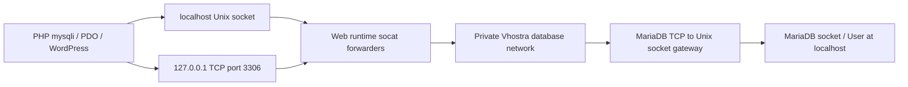

# Database access and localhost authentication

Vhostra keeps MariaDB in its independent persistent container. Web/PHP replacement, PHP selection, server selection, and Keep reset must not replace the database or its host-backed data/configuration.

## Application connection path

PHP's mysqli and PDO socket defaults point to `/run/mysqld/mysqld.sock`; `/tmp/mysql.sock` remains a compatibility symlink. The web runtime provides that socket and a loopback TCP listener on port 3306. Each connection resolves the stable private-network alias `vhostra-mariadb`. In the database container, a mysql-owned socat gateway forwards to MariaDB's Unix socket. MariaDB itself runs with `--skip-networking`. It sees **localhost**, rather than the web container's changing Docker IP. The gateway runs as mysql, so it cannot gain root's OS socket authentication. The host TCP publication stays bound to 127.0.0.1 on the selected host port.

Applications retain `DB_HOST=localhost`. Their application port is 3306, even when desktop database tools use a different selected host port. Vhostra does not rewrite `wp-config.php` to a Docker hostname or automatically create wildcard aliases.

MariaDB accounts include both User and Host. A specific localhost account can shadow a wildcard account for the same username. This behavior is documented in [MariaDB CREATE USER / account names](https://mariadb.com/docs/server/reference/sql-statements/account-management-sql-statements/create-user). Vhostra's legacy database creation unconditionally created `user@%`. It could therefore leave a database behind on error 1396, and a valid wildcard password could still fail when a different localhost account matched.

## Account workflow

The Database screen loads application accounts on entry, after relevant mutations, and on explicit Refresh. It excludes root, anonymous, MariaDB/MySQL internal and current/legacy phpMyAdmin identities. It returns no authentication hashes. Rows display exact username/host, direct database privileges, global privileges where already present, and assigned roles. Roles are identified separately; their inherited access is not mislabeled as direct grants.

Custom defaults to Host `localhost`. Hosts are real SQL account configuration and validated as supported host patterns, IPs or IPv4/netmask values. Host names are normalized to lowercase. Username remains case-sensitive. `%`, `127.0.0.1` and Docker-specific accounts remain separate identities. A requested account which does not match the actual localhost path is refused; Vhostra does not silently substitute another account or change its password.

Database/account existence checks precede CREATE. Selecting an existing account verifies the exact identity and known password without CREATE USER or password reset. MariaDB cannot recover plaintext passwords; Vhostra asks for a credential and clears the form after each operation. New application credentials are not stored in settings, credential files, a long-lived secret registry or backups' public manifests. SQL and PHP probe credentials travel through stdin, never process arguments, Docker exec metadata or terminal output. SQL literals escape both quotes and backslashes under a known session SQL mode.

Setup requires the web runtime to be running. A database alone may still be listed/managed independently; setup cannot claim successful PHP connectivity without the application path. The probe runs the selected real LSPHP binary, reads its script from `/dev/stdin`, and tests mysqli and PDO against localhost/socket and 127.0.0.1/TCP. It checks CURRENT_USER against the selected User@Host, selects the database, and checks writes with session-owned temporary tables. No user Site files or tables are changed by diagnosis.

Application grants are SELECT, INSERT, UPDATE, DELETE, CREATE, DROP, ALTER, INDEX, CREATE TEMPORARY TABLES and LOCK TABLES on the selected database only. Database underscores are escaped in GRANT patterns so access to `app_db` cannot unintentionally include `appXdb`. Existing global, other-database and role grants are preserved. Failed setup removes only the newly created resources and newly added privileges. Explicit password changes are available in Database Access, explain their effect on all the account's databases, and restore original private authentication metadata if final verification fails.

The backend now accepts both single-column and historical two-column SHOW CREATE USER output and refuses missing authentication statements. This fixes an uncovered prior backup/authentication rollback gap; full backups retain the complete authentication plugin/clause in their existing private payload.

## Error, selection and performance behavior

Shared ErrorNotice displays a simple message, short explanation, collapsed Show details and existing diagnostic fields only. Details include cause/service, actual configuration file/line where reliably reported, safe affected values and sanitized technical output. Generated mounted paths are mapped back to host paths when known. Unknown errors retain sanitized output. The parser uses bounded strings and existing process output; it starts no diagnostics or scans.

Central redaction covers supplied request secrets, environment-style secrets, authentication strings, SQL authentication clauses, authorization headers, private material, credential URLs and WordPress password/salt definitions. Success messages last six seconds. Database errors remain until dismissed or superseded by another operation.

CSS defaults every UI element to unselectable. Explicit content semantics opt in values, errors/successes, diagnostic output, paths, terminal/log/configuration content, Help bodies and editors. Typography and ARIA roles do not grant selection. Headings, labels, navigation, summaries, buttons and diagnostic field labels remain unselectable. Inputs and textareas retain native selection, replacement, undo and redo. No selection listeners were added.

Database/grant enumeration and probes are on demand. There are four fixed metadata queries per account inventory load, processed in linear maps. Deeper probes run only on setup/access mutations or Check Database Access. There is no database polling, background credential enumeration or configuration scanning. No dependency, tracking, upload, telemetry or remote diagnostic request was added.

## Acceptance evidence

- Legacy isolated reproduction: `/private/tmp/vhostra-db-reproduction.log`, PHP localhost error 1045 with a valid wildcard password shadowed by a separate local account; legacy duplicate error 1396 left a partial database.
- Real SQL/PHP/WordPress: `test/database-access-runtime.mjs`, `/private/tmp/vhostra-database-access-live.log`. Exact duplicates, same username/different hosts, existing-user selection, password preservation, wrong password/user, missing grant, escaped grant scope, special passwords, failed-validation recovery, real official WordPress with DB_HOST=localhost, mysqli/PDO both local paths, phpMyAdmin and caches.
- Real Electron/IPC/MariaDB: `test/database-access-ui.electron.mjs`, `/private/tmp/vhostra-database-access-ui.log`. Immediate database row, refreshed account option, existing-user assignment, persistent sanitized failures, six-second success, screen selection semantics and native editor operations. Screenshots stay local under `/private/tmp/vhostra-database-*-ui.png`.
- Regression/parser/redaction: `/private/tmp/vhostra-database-unit.log`; production build: `/private/tmp/vhostra-db-build.log`.
- Prior native platform, administrator-prompt, startup/signing and licensed Enterprise acceptance limits remain in the existing completion queue. This phase does not imply their completion.

Final previous-feature regressions also exited 0: `/private/tmp/vhostra-database-persistence-regression.log`, `/private/tmp/vhostra-database-backup-regression.log`, `/private/tmp/vhostra-database-desktop-regression.log`. Final build and 99/99 regression contracts pass. Task-owned fixtures were removed; review logs/screenshots remain local.
